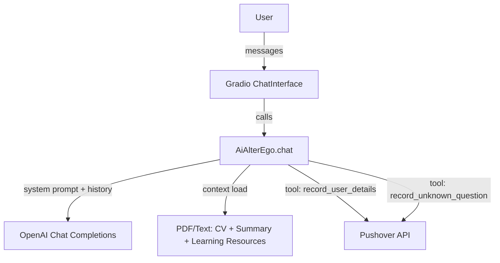

## AI Alter Ego – Interactive Portfolio Chatbot

An interactive AI that represents me (Ulysse Zampogna) and answers questions about my experience, projects, and skills. The Chatbot uses my CV and other docs, chats in multiple languages, and send me notification to collect interest or unknown questions.

### Why this project
- **Practical AI**: Uses frontier LLMs with real personal data (PDF + text) to deliver a useful, demo‑ready product.

### Quick demo
Run locally and open the URL in your browser to chat with the AI alter ego.

### Live deployment
The app is deployed and accessible here: [Hugging Face Space – UZ31/career_conversation](https://huggingface.co/spaces/UZ31/career_conversation)

## Features
- **Conversational portfolio**: Answers questions grounded in my CV and summary.
- **Multi‑language**: Responds in the user’s language automatically.
- **Initial greeting + avatar**: Polished default message and profile image.
- **Signal capture**: Tool calls to record user interest and unknown questions (optional Pushover notifications).
- **Simple, fast UI**: Built with Gradio’s `ChatInterface`.

## Architecture


## Tech stack
- **Python**: application logic
- **Gradio**: chat UI (`ChatInterface` + `Chatbot`)
- **OpenAI**: assistant responses
- **PyPDF**: PDF text extraction
- **dotenv**: configuration via `.env`
- **Requests**: optional notifications via Pushover

## Getting started
### Prerequisites
- Python 3.10+
- An OpenAI API key

### Setup
1) Clone the repo
```bash
git clone https://github.com/<your-username>/cv_ai_assistant.git
cd cv_ai_assistant
```
2) Create a `.env` file
```bash
OPENAI_API_KEY=sk-...
# Optional (to receive push notifications)
PUSHOVER_TOKEN=...
PUSHOVER_USER=...
```
3) Add your content under `me/`
- `Ulysse Zampogna - CV 2025.pdf`
- `linkedin.pdf`
- `summary.txt`
- `learning_resources.txt` (plain text list)
- `profile_picture.jpeg` (used for avatar)

4) Install dependencies (choose one)
```bash
# Using pip
python -m venv .venv && source .venv/bin/activate
pip install -U gradio openai python-dotenv pypdf requests

# Or using uv
uv venv && source .venv/bin/activate
uv pip install -U gradio openai python-dotenv pypdf requests
```

### Run
```bash
python app.py
# or
uv run app.py
```

Open the local URL printed by Gradio.

## Configuration tips
- Update the assistant’s title/theme/greeting in `app.py` where `gr.ChatInterface` is constructed.
- Replace the avatar by changing the `profile_picture.jpeg` in `me/`.
- Add/remove tool integrations (e.g., CRM webhook instead of Pushover) by editing the tool functions and their JSON schemas.

## Product thinking (TPM)
- **User journey**: curious visitor → asks questions → sees relevant answers → shares email → follow‑up.
- **KPIs**: message count/session, time‑to‑first‑value, email capture rate, unknown‑question rate, latency.
- **Safety & privacy**: local file reads; no data is stored by default; environment‑based secrets.

## License
MIT (or choose your preferred license)

